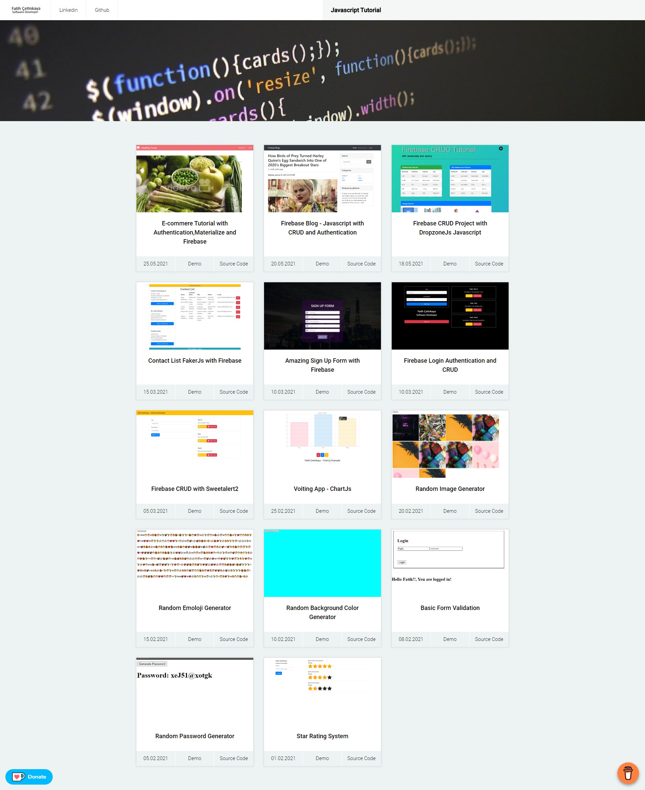

# Javascript Tutorials
I have prepared a project for those who want to get started with Javascript and for beginners.


## Table of contents
* [General info](#general-info)
* [Screenshots](#screenshots)
* [Demo](#demo)
* [Projects](#Projects)
* [Code Examples](#code-examples)

## General info
I have prepared a project for those who want to get started with Javascript and for beginners. You can find the codes and sample pages of this project on github.
In some examples it is used in firebase database.

## Screenshots



## Demo
https://fcetinkaya-javascript-tutorial.firebaseapp.com/

## Projects
1. E-Commere - Materialize and Authentication with Firebase
2. CRUD - SweetAlert2 with Firebase
3. Contact List - Faker.js Tutorial with Firebase
4. Login,Authentication and CRUD with Firebase
5. Voiting App - Chart.Js Tutorial with Firebase
6. Random Password Generator
7. Basic Form Validation
8. Random Background Color Generator
9. Random Image Generator
10. Random Emoji Generator
11. Star Rating System
12. Sign Up Form Firebase

## Code Examples
Show examples of usage:
```
 document.getElementById("formLogin").addEventListener("submit", (ee) => {
     ee.preventDefault();
     console.log(x.value);
     console.log(p.value);
     firebase.auth().signInWithEmailAndPassword(x.value, p.value)
         .then(() => {
             swal.fire({
                 position: 'center',
                 icon: 'success',
                 title: 'Welcome',
                 text: 'Access Granted'
             });
             x.value = '';
             p.value = '';
             setTimeout(() => {
                 loadPage();
             }, 3000)
         })
         .catch((error) => {
             swal.fire({
                 position: 'center',
                 icon: 'error',
                 title: 'Error',
                 text: 'Access Denied'
             });
             x.value = '';
             p.value = '';
         });

     function loadPage() {
         window.location.href = "./admin/admin.html";
     }
 });

```
